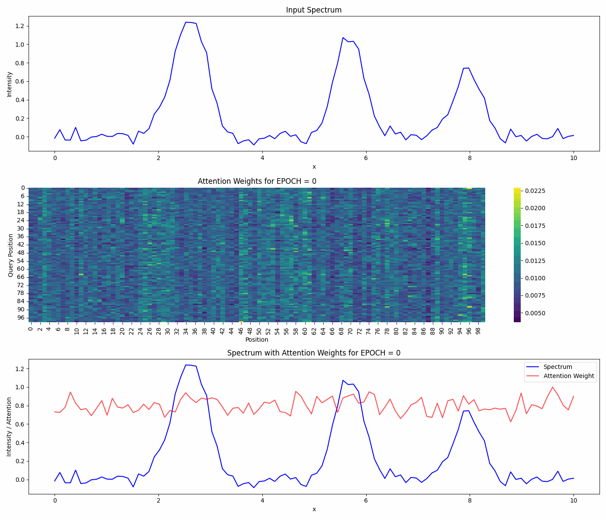

# Attention_for_materials
Lets explore how attention mechanism can help in improved physics discovery in material science

## 1. Several gaussian peaks
Q. If we train a Transformer regressor: Can Attention weights explain the model predicitons if we ask the model to predict a certain peak? 
    - Q. If yes how does the attention evolve with training?

<table>
  <tr>
    <td>
      
    </td>
  </tr>
</table>

## 2.